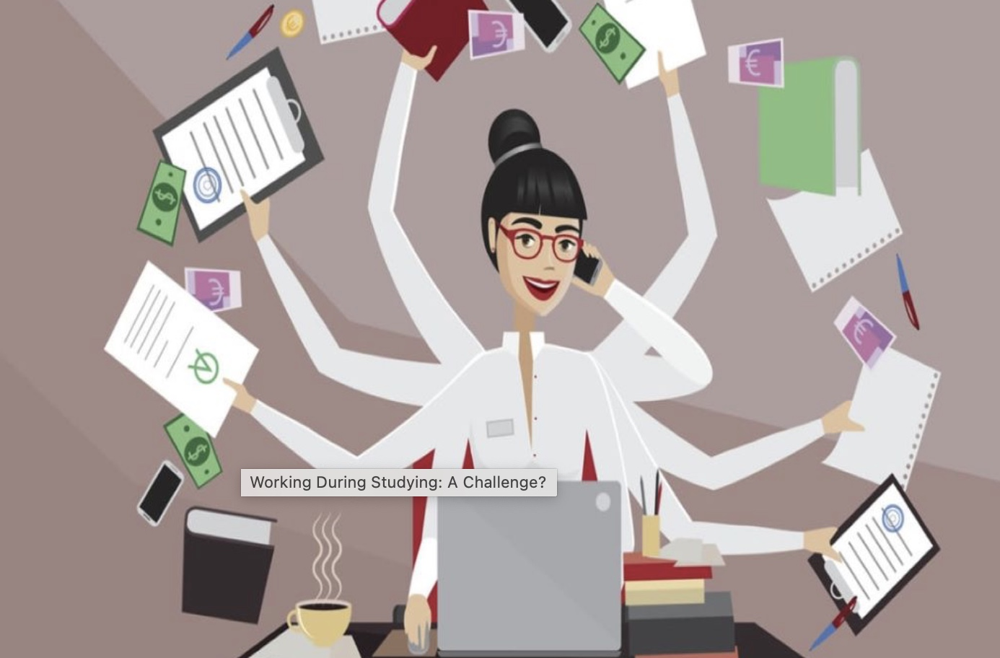

# 517-ravindran-gradschool

Practice Repository for 517

# My Grad School Journey So Far

When I decided I was going to get back into grad school, the next immediate step was to look into the schools that offered masters in technical communication.

## Choosing Schools

With my academic goals in mind, I chose to apply to the following colleges:

* NC State University 
* Missouri S&T
* Arizona State University

I then did a detailed analysis and ranked these colleges as follows according to how :

1. [NC State](www.ncsu.com)
2. [ASU](https://asuonline.asu.edu)
3. [Missouri S&T](www.mst.edu)

I based my decision on the college rankings given [here][another link]. 

## Sending in Applications

This was the most difficult part. It was hard to manage work and prepare applications but I did it!

## Making the Final Decision 

This was not hard at all! 
I alwayd knew I wanted to get into NC state, and I decided that was going to be my first choice while sending in the applications. 

### Recieving the Admit

Two months later, I got the admit mail from NC state!

### Getting the Visa

I finally got the visa and was elated to start my journey!

### Packing the Bags

After a strenous two months, I was relieved to pack my bags and leave, stepping on the path to realising my dreams of studying in the US!

### Arriving and Settling Down

It was a surreal feeling when I arrived and reached Raleigh. 

## Final Word

Well this was a year long journey, prepping my application and starting my grad school journey, but I'd say it was definitely worth it and would recommend it to anyone!

[another link]: https://www.niche.com/colleges/search/best-colleges/